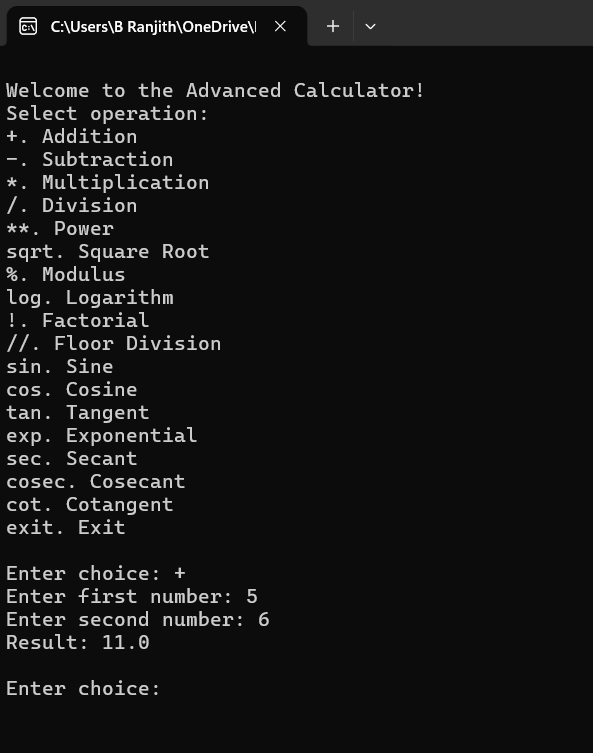

# Advanced Scientific Calculator (Python - CLI)

[](https://www.python.org/downloads/)
[](LICENSE)
[](test_sci_calc.py)

A clean, interactive command-line scientific calculator built in Python.  
It shares the same core math engine as [AdvSciCalcGUI](https://github.com/ranjithbrs/AdvSciCalcGUI), supporting basic arithmetic, logarithms, factorials, trigonometric/reciprocal trigonometric functions, inverse trigonometry, exponents, and comprehensive input validation.

---

## 📸 Example Usage



---

## ✨ Features
- **Basic Operations**: Addition (`+`), Subtraction (`-`), Multiplication (`*`), Division (`/`)
- **Advanced Math**: Power (`**`), Square Root (`sqrt`), Modulus (`%`), Floor Division (`//`)
- **Logarithms & Factorials**: Logarithm (`log` - base 10 / custom), Natural Logarithm (`ln`), Factorial (`!`)
- **Exponential**: Exponential function (`exp` - $e^x$)
- **Trigonometric Functions**: Sine (`sin`), Cosine (`cos`), Tangent (`tan`)
- **Reciprocal Trigonometry**: Secant (`sec`), Cosecant (`cosec`), Cotangent (`cot`)
- **Inverse Trigonometry**: Arcsine (`asin`), Arccosine (`acos`), Arctangent (`atan`)
- **Robust Error Handling**: Handles division by zero, invalid log bases, negative roots, undefined trig limits, and non-numeric inputs cleanly without crashing.

---

## 📋 Operation Menu Options

When you run the calculator CLI, you can select from the following options:

| Option | Operation | Example Input |
| :--- | :--- | :--- |
| `+` | Addition | `5` and `6` $\rightarrow$ `11.0` |
| `-` | Subtraction | `10` and `4` $\rightarrow$ `6.0` |
| `*` | Multiplication | `3` and `7` $\rightarrow$ `21.0` |
| `/` | Division | `20` and `5` $\rightarrow$ `4.0` |
| `**` | Power | `2` and `3` $\rightarrow$ `8.0` |
| `sqrt` | Square Root | `16` $\rightarrow$ `4.0` |
| `%` | Modulus | `10` and `3` $\rightarrow$ `1.0` |
| `log` | Logarithm | Value `8`, Base `2` $\rightarrow$ `3.0` |
| `ln` | Natural Logarithm ($e$) | Value `2.718282` $\rightarrow$ `1.0` |
| `!` | Factorial | `5` $\rightarrow$ `120` |
| `//` | Floor Division | `10` and `3` $\rightarrow$ `3.0` |
| `sin` | Sine (degrees) | `90` $\rightarrow$ `1.0` |
| `cos` | Cosine (degrees) | `0` $\rightarrow$ `1.0` |
| `tan` | Tangent (degrees) | `45` $\rightarrow$ `1.0` |
| `exp` | Exponential ($e^x$) | `1` $\rightarrow$ `2.718282` |
| `sec` | Secant (degrees) | `0` $\rightarrow$ `1.0` |
| `cosec` | Cosecant (degrees) | `90` $\rightarrow$ `1.0` |
| `cot` | Cotangent (degrees) | `45` $\rightarrow$ `1.0` |
| `asin` | Arcsine | `1` $\rightarrow$ `90.0` |
| `acos` | Arccosine | `1` $\rightarrow$ `0.0` |
| `atan` | Arctangent | `1` $\rightarrow$ `45.0` |
| `exit` | Exit Application | Ends the interactive session |

---

## 🚀 How to Run

### Prerequisites
- Python 3.8 or higher installed on your system.

### Running the Calculator CLI
1. Clone the repository:
   ```bash
   git clone https://github.com/ranjithbrs/advanced_calculator_python.git
   cd advanced_calculator_python
   ```
2. Run the Python application:
   ```bash
   python sci_calc.py
   ```

---

## 🧪 Running Unit Tests

The repository includes an automated unit test suite covering all operations and edge cases.

To execute the test suite, run:
```bash
python -m unittest test_sci_calc.py
```

---

## 📄 License

This project is licensed under the MIT License - see the [LICENSE](LICENSE) file for details.
