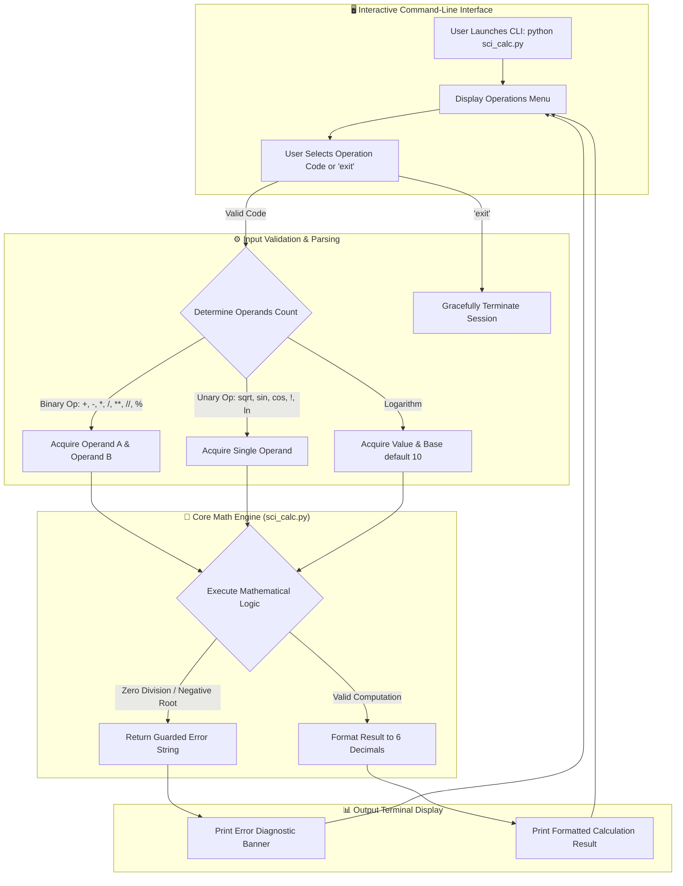

# 🧮 Advanced Scientific Calculator (Python CLI)

[](https://www.python.org/downloads/)
[](sci_calc.py)
[](https://github.com/ranjithbrs/AdvSciCalcGUI)
[](test_sci_calc.py)
[](LICENSE)

> A modular, interactive command-line scientific calculator built in Python. Serves as both a standalone console calculator and an importable mathematical computation engine with complete unit test coverage, domain validation, and zero external dependencies.

---

## 📸 Example Usage


---

## 📑 Table of Contents
- [Architecture & Execution Workflow](#-architecture--execution-workflow)
- [Key Features](#-key-features)
- [Operation Menu & Supported Functions](#-operation-menu--supported-functions)
- [Local Setup & Usage](#-local-setup--usage)
- [Automated Unit Testing](#-automated-unit-testing)
- [Desktop GUI Version](#-desktop-gui-version)
- [Author & Connect](#-author)
- [License](#-license)

---

## 📐 Architecture & Execution Workflow



---

## ✨ Key Features

- **Basic & Advanced Arithmetic**: Addition, subtraction, multiplication, floating-point division, integer floor division (`//`), modulus (`%`), and arbitrary exponentiation (`**`).
- **Comprehensive Trigonometry**: Direct evaluation of sine (`sin`), cosine (`cos`), and tangent (`tan`) in degrees, alongside reciprocal secant (`sec`), cosecant (`cosec`), and cotangent (`cot`).
- **Inverse Trigonometric Functions**: Arcsine (`asin`), arccosine (`acos`), and arctangent (`atan`) with domain validation.
- **Logarithmic & Exponential Suite**: Arbitrary-base logarithms (`log`), natural logarithms (`ln`), and Euler's exponential powers (`exp`).
- **Combinatorics**: Integer factorials (`!`) with input validation preventing fractional or negative evaluations.
- **Defensive Error Handling**: Traps division by zero, invalid logarithm bases ($b \le 0, b = 1$), imaginary square roots, and type mismatches without crashing the session loop.

---

## 📋 Operation Menu & Supported Functions

| Option Code | Operation | Mathematical Formula | Example Input $\rightarrow$ Output |
| :--- | :--- | :--- | :--- |
| `+` | Addition | $a + b$ | `5` and `6` $\rightarrow$ `11.0` |
| `-` | Subtraction | $a - b$ | `10` and `4` $\rightarrow$ `6.0` |
| `*` | Multiplication | $a \times b$ | `3` and `7` $\rightarrow$ `21.0` |
| `/` | Division | $a / b$ | `20` and `5` $\rightarrow$ `4.0` |
| `**` | Exponentiation | $a^b$ | `2` and `3` $\rightarrow$ `8.0` |
| `sqrt` | Square Root | $\sqrt{a}$ | `16` $\rightarrow$ `4.0` |
| `%` | Modulo | $a \pmod b$ | `10` and `3` $\rightarrow$ `1.0` |
| `log` | Logarithm | $\log_b(a)$ | `8`, Base `2` $\rightarrow$ `3.0` |
| `ln` | Natural Log | $\ln(a)$ | `2.718282` $\rightarrow$ `1.0` |
| `!` | Factorial | $n!$ | `5` $\rightarrow$ `120` |
| `//` | Floor Division | $\lfloor a / b \rfloor$ | `10` and `3` $\rightarrow$ `3.0` |
| `sin` | Sine (Degrees) | $\sin(\theta)$ | `90` $\rightarrow$ `1.0` |
| `cos` | Cosine (Degrees) | $\cos(\theta)$ | `0` $\rightarrow$ `1.0` |
| `tan` | Tangent (Degrees) | $\tan(\theta)$ | `45` $\rightarrow$ `1.0` |
| `exp` | Exponential | $e^x$ | `1` $\rightarrow$ `2.718282` |
| `sec` | Secant | $\sec(\theta)$ | `0` $\rightarrow$ `1.0` |
| `cosec` | Cosecant | $\csc(\theta)$ | `90` $\rightarrow$ `1.0` |
| `cot` | Cotangent | $\cot(\theta)$ | `45` $\rightarrow$ `1.0` |
| `asin` | Arcsine | $\arcsin(x)$ | `1` $\rightarrow$ `90.0` |
| `acos` | Arccosine | $\arccos(x)$ | `1` $\rightarrow$ `0.0` |
| `atan` | Arctangent | $\arctan(x)$ | `1` $\rightarrow$ `45.0` |
| `exit` | Terminate Session | — | Exits interactive loop cleanly |

---

## 🚀 Local Setup & Usage

### Prerequisites
- Python 3.8 or higher installed on your system.

### 1. Clone the Repository
```bash
git clone https://github.com/ranjithbrs/advanced_calculator_python.git
cd advanced_calculator_python
```

### 2. Run the Interactive CLI
```bash
python sci_calc.py
```

### 3. Use as a Python Module
`sci_calc.py` can be directly imported into any Python project:
```python
import sci_calc

print(sci_calc.addition(15, 25))        # 40.0
print(sci_calc.sine(90, mode="deg"))     # 1.0
print(sci_calc.factorial(6))             # 720
```

---

## 🧪 Automated Unit Testing

The repository features an automated test suite verifying all mathematical routines, boundary conditions, and exception handlers:

```bash
python -m unittest test_sci_calc.py -v
```

Output:
```text
Ran 8 tests in 0.001s

OK
```

---

## 🖥️ Desktop GUI Version

Looking for a desktop application with an LCD display, mouse keypad, calculation history, and standalone `.exe` packaging? Check out the sister repository:  
👉 **[AdvSciCalcGUI](https://github.com/ranjithbrs/AdvSciCalcGUI)**

---

## 👨‍💻 Author

**Ranjith B**  
🎓 *B.Tech Computer Science & Business Systems (CSBS)*  
🏛️ *Nehru Institute of Engineering and Technology, Coimbatore*  

- 💼 **LinkedIn**: [linkedin.com/in/ranjith-b-85907831a](https://linkedin.com/in/ranjith-b-85907831a)  
- 🐙 **GitHub**: [github.com/ranjithbrs](https://github.com/ranjithbrs)  
- 🌐 **Portfolio**: [ranjithbrs.github.io/portfolio](https://ranjithbrs.github.io/portfolio/)  
- 📧 **Email**: ranjithb2k06@gmail.com  

---

## 📄 License

This project is licensed under the [MIT License](LICENSE).
